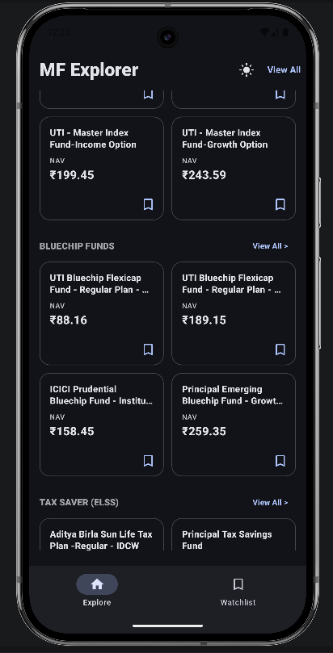
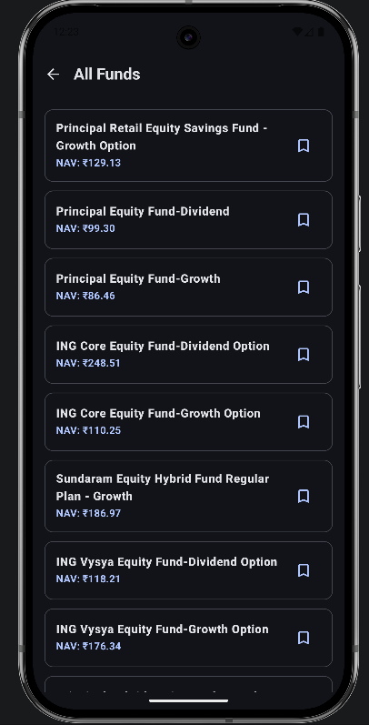
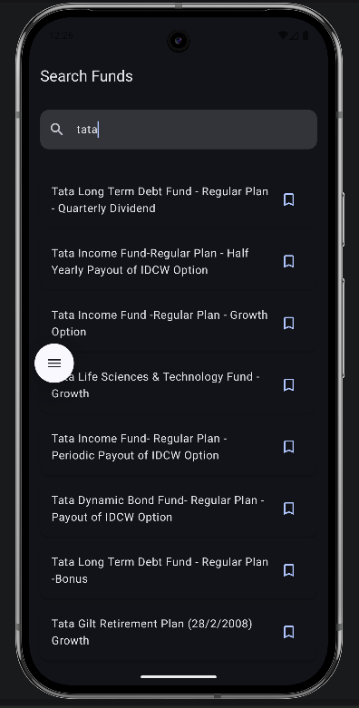
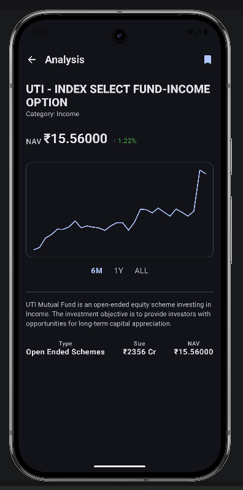
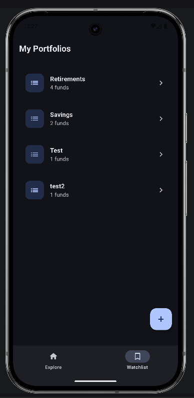

# Fund Explorer

A modern Android application designed to help users search, explore, and track mutual funds. Built
with Jetpack Compose and following modern Android development best practices, it provides a seamless
experience for managing your fund watchlists.

## Download APK

[⬇️ Download FundExplorer-v1.0 APK](https://raw.githubusercontent.com/aviirajsharma/FundExplorer/blob/main/apk/fund_explorer.apk)
 
---

## Screenshots

<table>
  <tr>
<td align="center">
      
      <br><br>
      <strong>Explore Funds</strong>
    </td>
<td align="center">
      
      <br><br>
      <strong>All Funds</strong>
    </td>
    <td align="center">
      
      <br><br>
      <strong>Search Funds</strong>
    </td>
    <td align="center">
      
      <br><br>
      <strong>Fund Details</strong>
    </td>
    <td align="center">
      
      <br><br>
      <strong>Watchlist</strong>
    </td>
  </tr>
</table>
 
---

## Demo

<table>
  <tr>
    <td align="center">
      <a href="https://drive.google.com/file/d/1ZBdXGmSSRBPOq1MqjNEI9zJfca9pMHTA/view?usp=sharing">
        🎥 Watch App Demo
      </a>
    </td>
  </tr>
</table>
 
---

## Features

- **Explore Funds** — Browse mutual funds categorized by types like Index Funds, Bluechip Funds, Tax
  Savers (ELSS), and Large Cap Funds.
- **Search** — Quickly find specific mutual funds using a robust search functionality.
- **Fund Details** — View comprehensive details about each fund to make informed decisions.
- **Watchlists** — Create custom watchlist folders to organize and track your favorite funds.
- **Offline Support** — Local caching of watchlists using Room database.

---

## Tech Stack

| Layer                | Technology                   |
|----------------------|------------------------------|
| Language             | Kotlin                       |
| UI                   | Jetpack Compose + Material 3 |
| Architecture         | MVVM + Clean Architecture    |
| Dependency Injection | Hilt                         |
| Networking           | Retrofit + OkHttp + Gson     |
| Local Database       | Room                         |
| Async                | Kotlin Coroutines + Flow     |
| Navigation           | Navigation Compose           |

 
---

## Project Structure

```
app/
├── data/          # Repositories, data sources (local & remote), models
├── di/            # Hilt dependency injection modules
├── ui/            # Compose screens, components, and ViewModels
└── navigation/    # Navigation graph and route definitions
```

 
---

## Prerequisites

- Android Studio (Ladybug or newer)
- JDK 11+
- Android SDK (API 24+)

---

## Getting Started

1. Clone the repository:
   ```bash
   git clone https://github.com/avirajsharma/FundExplorer.git
   ```

2. Open the project in **Android Studio**.

3. Sync the project with Gradle files.

4. Run the app on an emulator or a physical device.

---

## License

This project is for educational purposes.
 
---

Developed by [Aviraj Sharma](https://github.com/avirajsharma)
